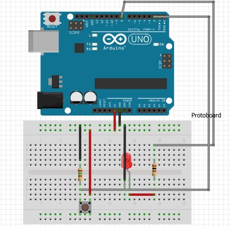

# Confec Resultado

> 🚀 Projeto desenvolvido em PHP e Python, utilizando a placa arduino UNO R3, com objetivo de automatizar o processo de conferência de uma linha de prdução textil.

<p align="center">
  <a href="#-requisitos">Requisitos</a>&nbsp;&nbsp;&nbsp;|&nbsp;&nbsp;&nbsp;
  <a href="#-executando-o-projeto">Executando o projeto</a>&nbsp;&nbsp;&nbsp;|&nbsp;&nbsp;&nbsp;
  <a href="#-tecnologias">Tecnologias</a>&nbsp;&nbsp;&nbsp;|&nbsp;&nbsp;&nbsp;
  <a href="#-autor">Autor</a>&nbsp;&nbsp;&nbsp;|&nbsp;&nbsp;&nbsp;
  <a href="#-contribuição">Contribuição</a>&nbsp;&nbsp;&nbsp;|&nbsp;&nbsp;&nbsp;
  <a href="#-licença">Licença</a>
</p>

### 🚧  Confec Resultado 🚀 Em construção...  🚧

<p float="left">
  
  
</p>

> 📋 Após os cadastros de operadores e máquinas, o arduíno realiza a contagem de peças produzidas possibilitando a gereção de relatórios analíticos e dashboards.

### ⚙️ Requisitos

Antes de começar, você vai precisar ter instalado as seguintes ferramentas:
[Git](https://git-scm.com).
[IDLE Shell](https://docs.python.org/3/library/idle.html).
[Apache](https://www.apachefriends.org/pt_br/index.html).
[MariaDB](https://mariadb.org/).
Opicionalmente você pode utilizar o software [Fritizing](https://fritzing.org/) para realizar a prototipação da configuração da placa arduino, também você pode usar o editor de código [VSCode](https://code.visualstudio.com/)

### 🎲 Executando o projeto

```bash
# Clone este repositório
$ git clone <https://github.com/GuilhermeAFerrari/confec-result.git>

Altere os arquivos conexao.php (conefc-result/controller) e o arquivo script.py (confec-result/python) com as informações do seu banco de dados.
Execute o arquivo script.py (confec-result/python) com o terminal IDLE Shell.
Execute o arquivo index.php (confec-result) com o localhost do seu servidor apache.
```
### 🛠 Tecnologias

As seguintes ferramentas foram usadas na construção do projeto:

- [HTML](https://developer.mozilla.org/pt-BR/docs/Web/HTML)
- [CSS](https://developer.mozilla.org/pt-BR/docs/Web/CSS)
- [JavaScript](https://developer.mozilla.org/pt-BR/docs/Web/JavaScript)
- [PHP](https://www.php.net/)
- [Python](https://www.python.org/)
- [MariaDB](https://mariadb.org/)
- [Apache](https://www.apachefriends.org/pt_br/index.html)

### 😎 Autor

Guilherme Ferrari - guile.ferrari@hotmail.com

[](https://www.linkedin.com/in/guilherme-antonio-ferrari/)

### 🎯 Contribuição

1. Faça o _fork_ do projeto
2. Crie uma _branch_ para sua modificação (`git checkout -b feature/descricaoFeature`)
3. Faça o _commit_ (`git commit -am 'Add descricaoFeature'`)
4. _Push_ (`git push origin feature/descricaoFeature`)
5. Crie um novo _Pull Request_

### 📝 Licença

MIT.